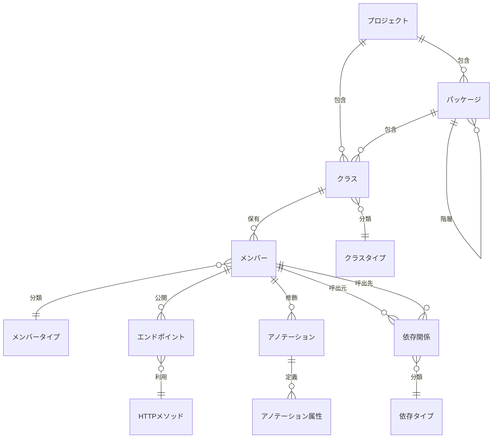

## 概要
SplringBootアプリケーションのクラスの依存関係を解析するツールの基本機能を実装する。
まずは指定パッケージに対して、静的または動的解析を実施し、クラス間の依存関係を調査する。
調査結果はDBに保存し、解析結果のサマリを画面表示する。

## DB
JPAとH2インメモリデータベースによるデータアクセスを実装する

### 概念データモデル図

---
## 画面
- テキスト入力（input type="text"）
-- 解析対象プロジェクト（解析対象プロジェクトのルートのフルパスを入力）

- ボタン（input type="submit"）
-- 解析実行ボタン（解析を実行する）

- 解析結果表示（解析実行後に表示または再更新）
-- 対象プロジェクト（パス）
-- パッケージリスト
-- 検出されたクラス数（パッケージごとに整理）
-- クラスリスト（パッケージごとに整理）
-- 検出された依存関係の種類別件数リスト（パッケージごとに整理）

---
## 機能概要
### 1. 基本型依存関係の解析
SpringBootアプリケーションのクラス間の基本型依存関係を、ソースコードを解析する際に抽出・記録する
本機能の詳細仕様についてはdoc\RequirementsSpecification\usdm\specifications\配下の以下を参照する。
- SPC-001.001-001.md
- SPC-001.002-001.md
- SPC-001.003-001.md
- SPC-001.004-001.md
- SPC-001.005-001.md
- SPC-001.006-001.md
- SPC-001.007-001.md
- SPC-001.008-001.md
- SPC-001.009-001.md
- SPC-001.010-001.md
- SPC-001.011-001.md

### 2. DI（依存性注入）依存関係の解析
SpringBootアプリケーションのDI（依存性注入）パターンによる依存関係を、ソースコードを解析する際に抽出・記録する
本機能の詳細仕様についてはdoc\RequirementsSpecification\usdm\specifications\配下の以下を参照する。
- SPC-002.001-001.md
- SPC-002.002-001.md
- SPC-002.003-001.md
- SPC-002.004-001.md
- SPC-002.005-001.md
- SPC-002.006-001.md
- SPC-002.007-001.md

### 3. 永続化層依存関係の解析
SpringBootアプリケーションの永続化層（Repository、Entity、DTO）の依存関係を、ソースコードを解析する際に抽出・記録する
本機能の詳細仕様についてはdoc\RequirementsSpecification\usdm\specifications\配下の以下を参照する。
- SPC-003.001-001.md
- SPC-003.002-001.md
- SPC-003.003-001.md
- SPC-003.004-001.md
- SPC-003.005-001.md

### 4. 設定・構成依存関係の解析
SpringBootアプリケーションの設定値、プロファイル、ビルド構成による依存関係を、ソースコードと設定ファイルを解析する際に抽出・記録する
本機能の詳細仕様についてはdoc\RequirementsSpecification\usdm\specifications\配下の以下を参照する。
- SPC-004.001-001.md
- SPC-004.002-001.md
- SPC-004.003-001.md
- SPC-004.004-001.md
- SPC-004.005-001.md

### 5. 外部サービス・イベント依存関係の解析
SpringBootアプリケーションの外部サービス連携とイベント処理による依存関係を、ソースコードを解析する際に抽出・記録する
本機能の詳細仕様についてはdoc\RequirementsSpecification\usdm\specifications\配下の以下を参照する。
- SPC-005.001-001.md
- SPC-005.002-001.md
- SPC-005.003-001.md

### 6. 横断的関心事依存関係の解析
SpringBootアプリケーションの横断的関心事（AOP、観測性、バリデーション）による依存関係を、ソースコードを解析する際に抽出・記録する
本機能の詳細仕様についてはdoc\RequirementsSpecification\usdm\specifications\配下の以下を参照する。
- SPC-006.001-001.md
- SPC-006.002-001.md
- SPC-006.003-001.md
- SPC-006.004-001.md

### 7. セキュリティ依存関係の解析
SpringBootアプリケーションのセキュリティ機能（認証、認可、フィルタ等）による依存関係を、ソースコードを解析する際に抽出・記録する
本機能の詳細仕様についてはdoc\RequirementsSpecification\usdm\specifications\配下の以下を参照する。
- SPC-007.001-001.md
- SPC-007.002-001.md
- SPC-007.003-001.md
- SPC-007.004-001.md
- SPC-007.005-001.md
- SPC-007.006-001.md
- SPC-007.007-001.md
- SPC-007.008-001.md
- SPC-007.009-001.md
- SPC-007.010-001.md
- SPC-007.011-001.md
- SPC-007.012-001.md
- SPC-007.013-001.md
- SPC-007.014-001.md
- SPC-007.015-001.md
- SPC-007.016-001.md
- SPC-007.017-001.md

### 8. ライブラリ依存関係の解析
SpringBootアプリケーションの外部ライブラリ（Lombok、Jackson等）による依存関係を、ソースコードを解析する際に抽出・記録する
本機能の詳細仕様についてはdoc\RequirementsSpecification\usdm\specifications\配下の以下を参照する。
- SPC-008.001-001.md
- SPC-008.002-001.md

### 9. アーキテクチャ依存関係の解析
 SpringBootアプリケーションのアーキテクチャ層（Controller、Service、Repository）の依存関係とレイヤー違反を、ソースコードを解析する際に抽出・検出する
本機能の詳細仕様についてはdoc\RequirementsSpecification\usdm\specifications\配下の以下を参照する。
- SPC-009.001-001.md
- SPC-009.002-001.md
- SPC-009.003-001.md
- SPC-009.004-001.md
- SPC-009.005-001.md

### 10. 設計品質指標の解析
SpringBootアプリケーションの設計品質指標（循環依存、レイヤー違反等）を、依存関係グラフを解析する際に検出・報告する
本機能の詳細仕様についてはdoc\RequirementsSpecification\usdm\specifications\配下の以下を参照する。
- SPC-010.001-001.md
- SPC-010.002-001.md
- SPC-010.003-001.md