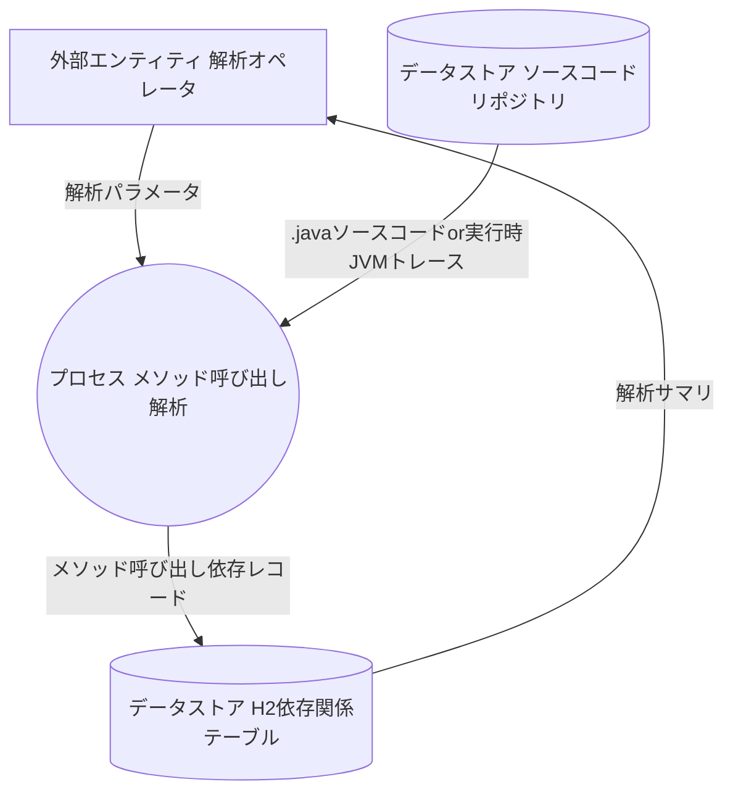
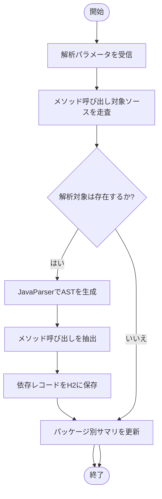

specification_id: SPC-001.005-001
specification_title: メソッド呼び出しの解析仕様
## spec:
- [前提] SpringBootアプリケーションのソースコードが`targetProjectPath`配下に存在し、H2インメモリデータベースとJPAプロファイル`jpa`が初期化済であること。
- [入力] 解析オペレータが`targetProjectPath`と`targetPackagePattern`を指定し、`.java`ソースコードor実行時JVMトレースを対象にメソッド呼び出しを抽出する。
- [処理] JavaParser(静的) / BTrace/JVMTI(動的)を用いて`MethodCallExpr`を抽出（静的）。動的はJVMで実行時コールグラフを収集。抽出結果を依存レコードとして整形し、`class_dependencies`テーブルへ登録する。
- [出力] H2上の`class_dependencies`テーブルにメソッド呼び出し（他クラスのメソッドを呼び出して動作を委譲している状態）のレコードを記録し、解析結果画面にパッケージごとのサマリを反映する。
- [制約] 本仕様は静的解析or動的解析での実行を前提とし、JavaParserが対象ソースを正しくパースできる場合に限定する。

## input_fields:
| 論理名 | 物理名 | 型 | 説明 |
|---|---|---|---|
|解析対象プロジェクトパス|targetProjectPath|String|解析対象となるSpringBootアプリケーションのルートディレクトリ絶対パス。|
|解析対象パッケージパターン|targetPackagePattern|String|依存解析対象とするパッケージをAnt形式で指定（例:`com.example..*`）。|
|解析対象バッチ識別子|analysisBatchId|String|本仕様用の依存種別（例:`001_005`）と紐付く実行ID。|

## output_fields:
| 論理名 | 物理名 | 型 | 保存先（テーブル名） | 説明 |
|---|---|---|---|---|
|依存レコードID|dependencyRecordId|UUID|class_dependencies|依存レコードの主キー。|
|呼出元クラスFQN|sourceClassFqn|String|class_dependencies|依存を検出した呼出元クラスの完全修飾名。|
|依存先識別子|targetIdentifier|String|class_dependencies|メソッド呼び出し（他クラスのメソッドを呼び出して動作を委譲している状態）で参照する対象の完全修飾名。|
|依存種類コード|dependencyKindCode|String|class_dependencies|本仕様に対応する依存種別コード（例:`001_005`）。|
|検出タイムスタンプ|detectedAt|Timestamp|class_dependencies|解析実行時刻。|

## data_flow_diagram:

## process_flowchart:

