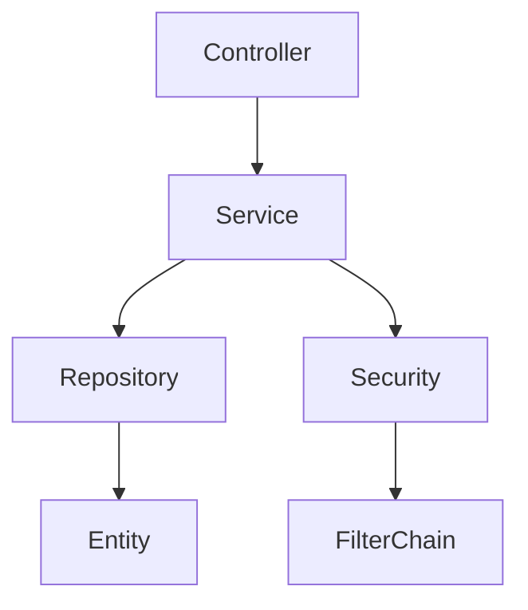

# 第1章　依存関係とは何か

ソフトウェアを作るとき、クラスやモジュールは単独では存在できません。あるクラスは別のクラスを使い、データ構造を参照し、ライブラリやフレームワークに支えられて動きます。
この「何かに頼る関係」を **依存関係（Dependency）** と呼びます。

---

## 1.1 ソフトウェアにおける依存とは

依存とは「AがなければBが動作できない関係」を指します。
例を見ましょう。

```java
class UserService {
    private UserRepository userRepository;

    public User findUser(Long id) {
        return userRepository.findById(id);
    }
}
```

この場合、

✅ `UserService` は `UserRepository` に依存している
→ `UserRepository` がなければ `UserService` は動作できない

依存とは **参照している関係**、**呼び出している関係**、**利用している関係** とも言い換えられます。

---

## 1.2 依存が発生する理由

オブジェクト指向では、責務を分割します。
するとクラス同士が連携し始め、自然に依存が発生します。

| 理由        | 依存の例                     |
| --------- | ------------------------ |
| 機能の分割     | Controller → Service     |
| 階層構造      | Service → Repository     |
| 外部との連携    | Repository → DB          |
| フレームワーク利用 | DI, Security, Validation |

依存は悪ではありません。**適切にコントロールすれば強力な構造**になります。

---

## 1.3 Spring Bootが依存だらけになる理由

Spring Bootアプリケーションは**依存が非常に多い**構造になりがちです。
なぜでしょうか？

✅ 理由は「DI（依存性注入）」「アノテーション」「自動構成」にあります。

### Spring Bootの依存例



さらに…

* `@Autowired` → DI依存を生む
* `@RequestMapping` → Web依存を生む
* `@Entity` → JPA依存を生む
* `@Transactional` → トランザクション依存が発生
* `@PreAuthorize` → Security依存が増える

✅ Spring Bootは「便利さの代償として依存が見えづらい構造」になる

---

## 1.4 良い依存と悪い依存

依存には種類があります。

| 種類        | 説明          | 例                            | 評価      |
| --------- | ----------- | ---------------------------- | ------- |
| 正常な依存     | 階層構造に沿った依存  | Controller → Service         | ✅ OK    |
| 抽象への依存    | インタフェースへの依存 | UserService → UserRepository | ✅ 理想    |
| 循環依存      | お互いが依存      | A → B → A                    | ❌ NG    |
| 強い結合      | 実装に依存       | Service → DbUserRepository   | ⚠ 要注意   |
| フレームワーク依存 | Springにべったり | `@Autowired everywhere`      | ⚠ 設計に注意 |

✅ このガイドの目的
👉 Spring Bootの依存を「整理・分類・可視化」して理解できるようにすること

---

📘 次の章
**第2章：Spring Bootアーキテクチャの依存構造** に進みます。
この章では **Spring Bootの構造を依存の視点から解説** します。
