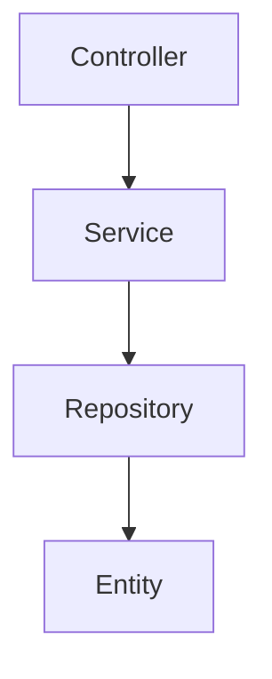
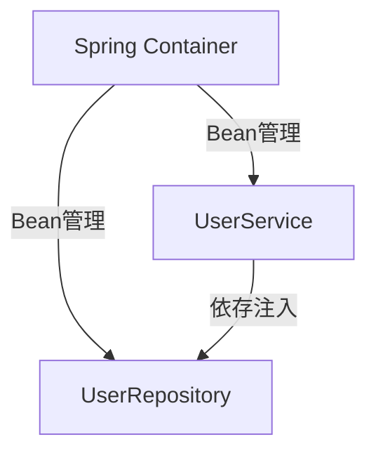
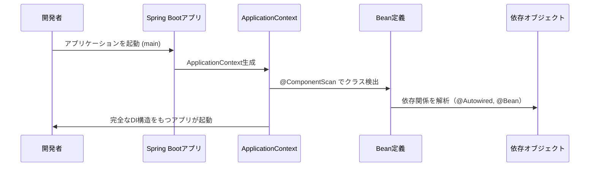
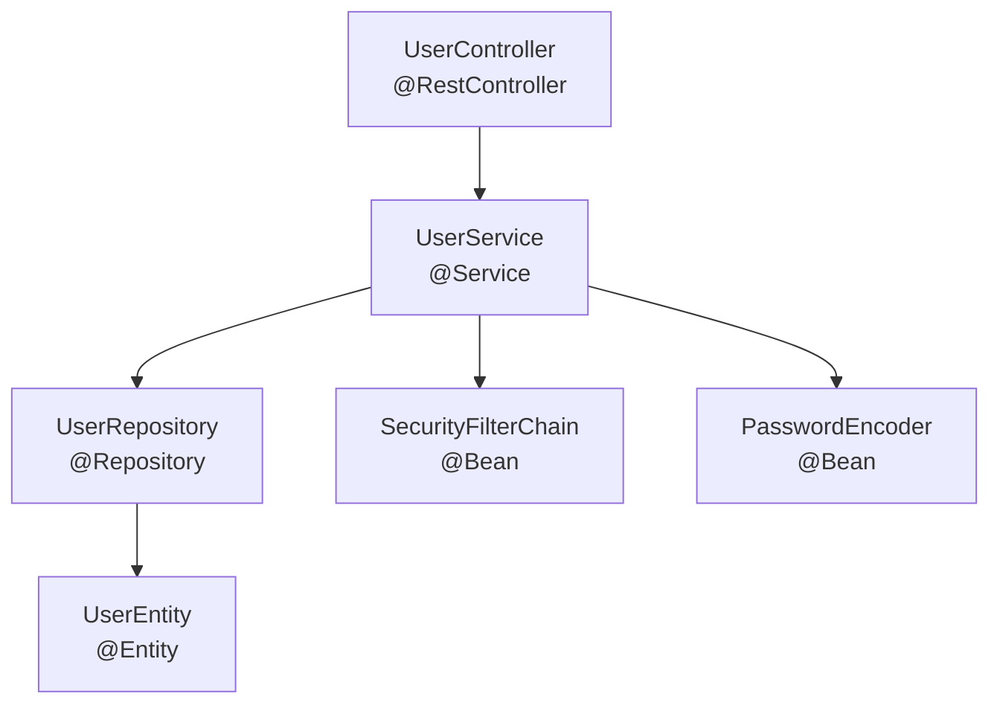

# 第2章　Spring Bootアーキテクチャの依存構造

Spring Bootは「依存を制御するフレームワーク」です。
アプリケーション開発を効率化する仕組みの多くは、裏で**依存関係の管理**に支えられています。

---

## 2.1　3層アーキテクチャと依存の方向

Spring BootのWebアプリケーションは、主に3つの層に分かれます。

| 層                             | 主な責務             | 代表クラス            | 依存先          |
| ----------------------------- | ---------------- | ---------------- | ------------ |
| **Presentation層（Controller）** | HTTPリクエスト処理・入力検証 | `UserController` | Service層     |
| **Service層**                  | ビジネスロジック         | `UserService`    | Repository層  |
| **Persistence層（Repository）**  | データベースアクセス       | `UserRepository` | Entity層（JPA） |

これらは下方向に依存します。



📌 **重要**
依存は一方向（上→下）であるべきです。
ControllerがRepositoryを直接呼ぶような「ショートカット依存」は避けましょう。

---

## 2.2　Spring Bootによる依存の解決メカニズム（DI）

Spring Bootでは「依存性注入（Dependency Injection, DI）」によって、
オブジェクトの生成や依存解決を自動化します。

### 例：DIによる依存の自動解決

```java
@Service
public class UserService {
    private final UserRepository userRepository;

    @Autowired
    public UserService(UserRepository userRepository) {  // ← 自動的に注入される
        this.userRepository = userRepository;
    }
}
```

🧩 Springは `@Service` と `@Repository` のアノテーションをスキャンして
Beanを生成し、コンストラクタの依存関係を自動的に解決します。



これにより、

* `new` を使わずに依存オブジェクトを利用できる
* テスト時にモックを差し替えやすい
* 構造が疎結合になる

という利点があります。

---

## 2.3　Spring Bootスターターによる依存の自動登録

Spring Bootは「スターター（Starter）」という依存のプリセットを提供しています。

| スターター名                         | 主な依存内容                      |
| ------------------------------ | --------------------------- |
| `spring-boot-starter-web`      | Spring MVC, Tomcat, Jackson |
| `spring-boot-starter-data-jpa` | Hibernate, Spring Data JPA  |
| `spring-boot-starter-security` | Spring Security             |
| `spring-boot-starter-test`     | JUnit, Mockito              |

これらを `pom.xml` に書くだけで、必要なライブラリがすべて導入され、
さらに **AutoConfiguration** により設定クラスも自動登録されます。

📘つまり：

> 「Spring Bootは依存関係を“自動的に組み立てる”仕組みを持つ」

---

## 2.4　依存解決の流れ（全体像）

以下はSpring Bootアプリ起動時に発生する依存解決の流れです。



---

## 2.5　依存の種類と責務の切り分け

| 依存の種類      | 発生箇所                                   | 例                          | 目的          |
| ---------- | -------------------------------------- | -------------------------- | ----------- |
| クラス依存      | `extends`, `implements`                | `implements UserDetails`   | 多態性確保       |
| Bean依存     | `@Autowired`, `@Bean`                  | `UserService(UserRepo)`    | DIによる制御     |
| Web依存      | `@RequestMapping`                      | `/api/users`               | リクエストルーティング |
| データ依存      | `@Entity`, `@Repository`               | JPA                        | 永続化管理       |
| Security依存 | `@PreAuthorize`, `SecurityFilterChain` | 権限管理                       | 認証認可制御      |
| 設定依存       | `@Value`, `application.yml`            | `@Value("${server.port}")` | 外部設定反映      |

---

## 2.6　依存の見える化（Mermaid例）



このように、Spring Bootアプリの構造は「依存線の集合」で表せます。
依存を正しく理解すれば、アプリ全体の動作が見通しやすくなります。

---

## 2.7　この章のまとめ

| 要点                                        | 解説                                        |
| ----------------------------------------- | ----------------------------------------- |
| Spring Bootは依存関係を中心に設計されている               | DI・AutoConfiguration・Starterなどすべて依存制御の仕組み |
| 層構造（Controller → Service → Repository）を守る | 一方向依存を維持する                                |
| 依存を明示的に設計することで可読性が向上                      | 「どの層がどの層に依存しているか」を図で確認することが大切             |

---

📘 **次章予告：第3章　依存関係の分類（概要）**

次の章では、実際にSpring Bootアプリで登場する依存を体系的に分類し、
「どのような種類の依存があるか」をリスト形式＋図解で整理します。

