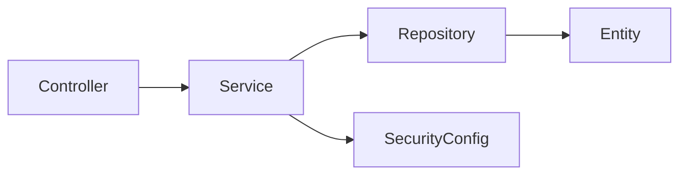

# 第3章　依存関係の分類（概要）

---

## 3.1　依存を分類する目的

Spring Bootアプリでは、数百〜数千のクラスが互いに依存しています。
これを「ただのコードのつながり」として見るのではなく、**意味のある関係**として分類することが重要です。

依存を分類する目的は次の3つです：

| 目的          | 内容                          |
| ----------- | --------------------------- |
| **① 理解のため** | どの層・どの機能がどこに依存しているかを明確にする   |
| **② 検証のため** | 設計ルール（層間依存など）が守られているか確認する   |
| **③ 改善のため** | 循環依存や強結合などを検出しリファクタリングに役立てる |

---

## 3.2　Spring Boot依存カテゴリ一覧（概要）

依存関係は大きく以下のカテゴリに分類できます。
（第4章以降で詳細化します）

| No | カテゴリ             | 説明                                     | 主な例                                    |
| -- | ---------------- | -------------------------------------- | -------------------------------------- |
| 1  | **型依存**          | クラスやインタフェース、継承などの関係                    | `extends`, `implements`, `import`      |
| 2  | **メソッド依存**       | メソッド呼び出しや引数・戻り値の型                      | `service.save()`, `List<User>`         |
| 3  | **フィールド依存**      | 他クラスをメンバとして保持                          | `private Address address;`             |
| 4  | **DI依存**         | 依存性注入（`@Autowired`, `@Bean`）による関係      | SpringのBean管理                          |
| 5  | **Spring MVC依存** | Web層の構造的依存                             | `@Controller`, `@RequestMapping`       |
| 6  | **Repository依存** | 永続化層・DBアクセス                            | `JpaRepository`, `@Entity`             |
| 7  | **DTO/Entity依存** | データ構造の依存                               | `UserDto`, `UserEntity`                |
| 8  | **設定依存**         | 設定ファイルや環境変数との依存                        | `@Value("${...}")`                     |
| 9  | **イベント依存**       | イベント発火・購読                              | `@EventListener`                       |
| 10 | **外部サービス依存**     | RESTやメッセージキューなど外部API                   | `RestTemplate`, `@FeignClient`         |
| 11 | **AOP依存**        | トランザクションやログなど横断処理                      | `@Transactional`, `@Aspect`            |
| 12 | **Security依存**   | 認証・認可の仕組み                              | `SecurityFilterChain`, `@PreAuthorize` |
| 13 | **JWT/セッション依存**  | 認証情報の保持方法                              | `SecurityContextHolder`, `JWTFilter`   |
| 14 | **アーキテクチャ依存**    | Controller → Service → Repository の層構造 | アプリ全体構成                                |
| 15 | **構成・ビルド依存**     | Maven, Starter, AutoConfigなど           | `spring-boot-starter-*`                |
| 16 | **設計指標依存**       | 循環依存や結合度の検出                            | 設計品質の評価                                |

---

## 3.3　依存カテゴリの図解（全体構造）

下の図は、Spring Bootアプリの依存カテゴリを「依存方向」で示したものです。

```mermaid
graph TD
    subgraph Web層
        A["Controller
@RestController"]
    end
    subgraph Service層
        B["Service
@Service"]
    end
    subgraph Repository層
        C["Repository"<br>"@Repository"]
        D["Entity"<br>"@Entity"]
    end
    subgraph CrossCutting
        E["Security"<br>"@PreAuthorize / @Bean"]
        F["AOP"<br>"@Transactional / @Aspect"]
        G["Config"<br>"@ConfigurationProperties"]
    end

    A --> B
    B --> C
    C --> D
    A -.-> E
    B -.-> F
    B -.-> G
    E -.-> G
```

🧩 **ポイント**

* 実線：通常の層依存（Controller → Service → Repository）
* 破線：横断的依存（Security, AOP, 設定など）
* 各依存が絡み合い、全体の制御構造を形成している

---

## 3.4　プロジェクト構造に当てはめてみる

典型的なSpring Bootプロジェクト構成と依存関係を照らし合わせてみましょう。

```
src/
 └── main/java/com/example/
     ├── controller/
     │   └── UserController.java   → Service層に依存
     ├── service/
     │   └── UserService.java      → Repository層に依存
     ├── repository/
     │   └── UserRepository.java   → Entityに依存
     ├── model/
     │   └── User.java             → データ構造
     └── config/
         └── SecurityConfig.java   → Security依存
```

依存の流れ：



📘このように構造を整理しておくと、

* 「どのクラスがどこに依存しているか」
* 「依存が正しい方向か」
  を可視化できます。

---

## 3.5　依存分類と解析ツールの関係

依存を分類しておくと、静的解析ツールを設計しやすくなります。

| 解析対象       | 解析方法                | 検出の例                                        |
| ---------- | ------------------- | ------------------------------------------- |
| 型依存        | Java AST / import解析 | クラスの継承関係を抽出                                 |
| メソッド依存     | 呼び出しグラフ解析           | `A.method()` → `B.method()`                 |
| DI依存       | アノテーション解析           | `@Autowired`, `@Bean` の注入先                  |
| Security依存 | Bean構成解析            | `SecurityFilterChain`, `UserDetailsService` |
| 設定依存       | プロパティ解決             | `@Value("${...}")` の依存先特定                   |

🧠つまり：

> 「どんな依存を見たいか」を明確にすれば、ツールが自動的に構造を描ける。

---

## 3.6　この章のまとめ

| 要点                          | 内容                               |
| --------------------------- | -------------------------------- |
| 依存には明確な種類がある                | 型依存、DI依存、Security依存など多数          |
| Spring Bootは多層依存＋自動構成依存の複合体 | Boot StarterやBeanスキャンで依存が自動生成される |
| 依存を分類することで設計品質が向上           | 見える化と静的解析の両面で活用可能                |

---

📘 **次章予告：第4章　Springにおける依存の仕組み**

ここからは、Springの中核である「DI」「AOP」「Bean管理」など、
**Spring Frameworkそのものが提供する依存制御の仕組み**を詳しく解説します。

