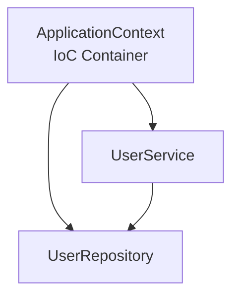

# 第4章　Springにおける依存の仕組み

Spring Framework は **オブジェクト間の依存を整理・管理するためのフレームワーク** です。
Spring Bootが便利なのは、このSpringの依存管理メカニズムの上に構築されているためです。

---

## 4.1　Springは「依存を管理するフレームワーク」

Springの目的は、**依存関係に秩序を与える**ことです。

✅ Springの核となるコンセプトは次の2つ：

* **DI（Dependency Injection）＝依存性注入**
* **IoC（Inversion of Control）＝制御の反転**

---

## 4.2　DI（依存性注入）とIoCコンテナ

通常のJava開発では、自分で依存するクラスを `new` して使います。

```java
// 典型的な依存の作り方
UserService service = new UserService(new UserRepository());
```

しかしSpringはこれを**禁止**します。

Springは「依存の生成はフレームワークが担当すべきである」と考えます。

```java
@Service
public class UserService {

    private final UserRepository repo;

    // Springが自動で依存を注入
    public UserService(UserRepository repo) {
        this.repo = repo;
    }
}
```

Springは `ApplicationContext`（IoCコンテナ）を持ち、アプリ内の依存関係を管理します。



---

## 4.3　DIの種類

| 種類                   | 特徴           | 推奨度     |
| -------------------- | ------------ | ------- |
| コンストラクタ注入            | 不変性の確保・テスト容易 | ✅ 推奨    |
| フィールド注入 (@Autowired) | 手軽だがテストしにくい  | ⚠ 非推奨   |
| セッター注入               | 可変性が高い       | △ 状況による |

---

## 4.4　Beanとは？ ～Spring依存の基本単位～

Springでは、DI管理対象のオブジェクトを **Bean** と呼びます。

Beanは次の方法で登録されます：

| 方法                  | 例                                        |
| ------------------- | ---------------------------------------- |
| コンポーネントスキャン         | `@Service`, `@Repository`, `@Controller` |
| Java Config (@Bean) | `@Configuration` 内の `@Bean`              |
| AutoConfiguration   | Spring Bootが自動登録するBean                   |

---

## 4.5　AOPによる依存の拡張

Springの特徴のひとつに **AOP（Aspect Oriented Programming）** があります。
これは、「横断的な依存」を追加する仕組みです。

```java
@Transactional
public void orderProcess() {
    // このメソッドの実行はトランザクションの対象になる
}
```

📌 `@Transactional` は何をしている？

```mermaid
graph LR
    Client --> ProxyClass["Proxy Service"
"(@Transactional)"]
    ProxyClass --> RealService
    ProxyClass --> TransactionManager
```

✅ AOPにより**依存構造はコードからは見えにくくなる**
→ のちの**依存解析で特に注意が必要**な分野

---

## 4.6　AutoConfigurationによる依存拡張

Spring Bootの特徴は「依存を自動で組み上げること」です。

```text
spring-boot-starter-web
   ├─ spring-web
   ├─ jackson-databind
   └─ tomcat
```

👆 `starter` を1行追加するだけで、多くの依存が自動登録される。

---

## 4.7　依存関係の見える化（例）

```mermaid
graph TD
    A[@RestController] --> B[@Service]
    B --> C[@Repository]
    B -.AOP.-> D[@Transactional]
    B -.DI.-> E[@Bean PasswordEncoder]
```

---

## ✅ 4章まとめ

| ポイント             | 内容                             |
| ---------------- | ------------------------------ |
| DIは依存管理の基礎       | Springは依存の接続点を自動で管理            |
| Beanは依存構造の単位     | 依存はApplicationContextが解決       |
| AOPは隠れた依存を発生させる  | @Transactionalやログ処理は依存を見えにくくする |
| Bootは自動構成で依存を増やす | 依存解析が重要になる理由                   |

---

📘 次章：**第5章　Spring Securityにおける依存構造**
