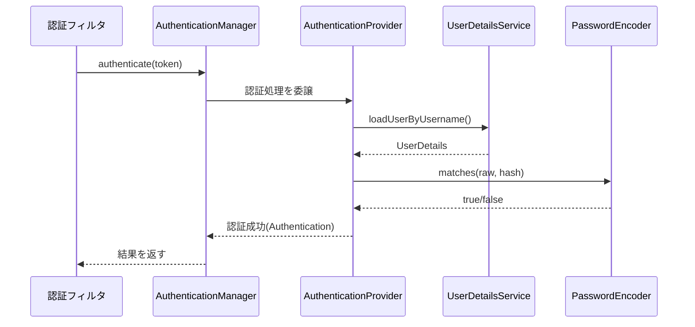
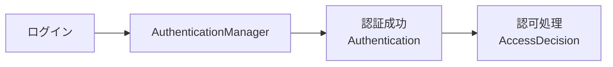
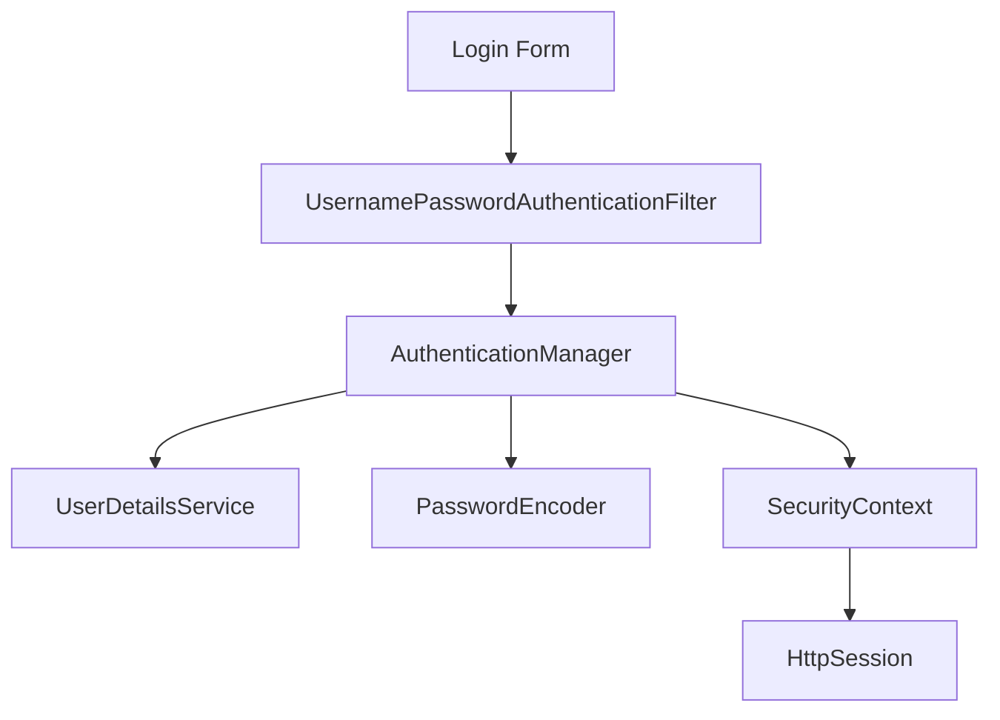
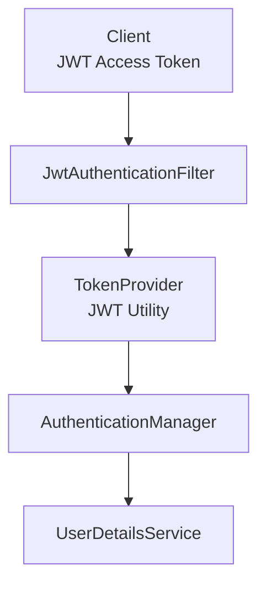
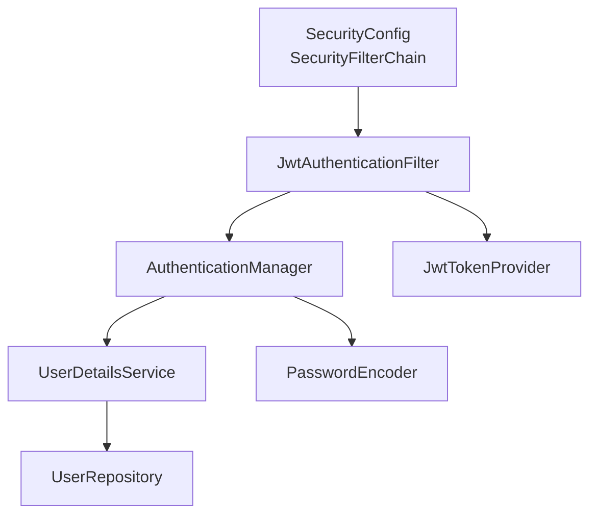

# 第5章　Spring Securityにおける依存構造（詳細）

Spring SecurityはSpring Bootの中でも**最も依存関係が複雑なコンポーネント**です。
「難しい」「理解しづらい」と言われがちですが、その理由の多くは **内部の依存構造が見えにくい** ことにあります。

---

## 5.1 なぜSpring Securityは難しいのか？

Spring Securityが難しいと言われる原因は以下の通りです：

| 理由               | 内容                     | 影響        |
| ---------------- | ---------------------- | --------- |
| 依存関係が多い          | 多くのクラスが連携して動く          | 学習コスト大    |
| 設計がレイヤー化         | 認証・認可・セッション・フィルタが階層構造  | 構造が見えにくい  |
| DI + AOPが多用されている | 仕組みが自動動作しやすい           | 魔法っぽく見える  |
| メインロジックはフィルタで動く  | Controllerに来る前に処理される   | デバッグが難しい  |
| 統合設計が必要          | ControllerやServiceとも依存 | システム理解が必要 |

---

## 5.2 Securityの依存モデル全体図

Spring Securityは以下のような**依存モデル**で構成されています。

```mermaid
graph TD
    subgraph 認証(Authentication)
        A[AuthenticationManager]
        B[AuthenticationProvider]
        C[UserDetailsService]
        D[PasswordEncoder]
    end

    subgraph 認可(Authorization)
        E[AccessDecisionManager]
        F[Role/Authority]
    end

    subgraph フィルタ処理
        G[SecurityFilterChain]
        H[UsernamePasswordAuthenticationFilter]
        I[JwtAuthenticationFilter]
    end

    A --> B --> C --> D
    G --> H
    G --> I
    H --> A
    I --> A
    A --> E
    E --> F
```

✅ ポイント

* フィルタが入口
* AuthenticationProviderが中心
* UserDetailsServiceとPasswordEncoderが認証の核
* Authorizationは後段で判断

---

## 5.3 認証(Authentication)の依存構造

認証の目的は「この人は誰か？」を確認すること。

### 認証で登場する依存クラス

| 役割      | クラス                      | 依存ポイント             |
| ------- | ------------------------ | ------------------ |
| 認証処理の起点 | `AuthenticationManager`  | Providerへ処理委譲      |
| 実際の認証担当 | `AuthenticationProvider` | DBまたはTokenを検証      |
| ユーザ情報提供 | `UserDetailsService`     | DBからUser読み込み       |
| パスワード検証 | `PasswordEncoder`        | BCryptやPBKDF2      |
| 認証結果の保持 | `Authentication`         | SecurityContextに保存 |

---

### 認証処理の依存フロー



✅ **認証の中心は `AuthenticationProvider`**
（Spring SecurityはProviderの集合で認証戦略を切り替える）

---

## 5.4 認可(Authorization)の依存構造

認可の目的は「この人に何が許可されるか？」を判断すること。

| 機能     | クラス                        | 依存                |
| ------ | -------------------------- | ----------------- |
| 認可の判定  | `AccessDecisionManager`    | Role/Authorityに依存 |
| 権限情報   | `GrantedAuthority`         | `ROLE_ADMIN`など    |
| メソッド認可 | `@PreAuthorize`            | SpEL依存            |
| URL認可  | `.authorizeHttpRequests()` | URLマッチ依存          |

### 認可の例

```java
@PreAuthorize("hasRole('ADMIN')")
public List<User> getAllUsers() { ... }
```

---

✅ 認証と認可は連携している



---

## 5.5 SecurityFilterChainの依存

Spring Securityの処理のほとんどは「フィルタ」で実装されています。

| フィルタ例                                  | 役割                       |
| -------------------------------------- | ------------------------ |
| `UsernamePasswordAuthenticationFilter` | フォームログイン処理               |
| `BasicAuthenticationFilter`            | AuthorizationヘッダのBasic認証 |
| `OncePerRequestFilter`                 | カスタムJWTフィルタ              |

それらをまとめるのが `SecurityFilterChain`

```java
@Bean
SecurityFilterChain security(HttpSecurity http) throws Exception {
    return http
        .authorizeHttpRequests(auth -> auth
            .requestMatchers("/admin/**").hasRole("ADMIN")
            .anyRequest().authenticated()
        )
        .build();
}
```

---

了解です！それでは第5章の続きを進めていきます 🔐

---

## 5.6　JWTとセッションの依存構造の違い

Spring Securityを使うプロジェクトでは、認証方式として主に次の2つが使われます。

| 認証方式        | 特徴                   | 依存の違い                                       |
| ----------- | -------------------- | ------------------------------------------- |
| **セッション認証** | Webアプリ向け（状態あり）       | `SessionAuthenticationStrategy` に依存         |
| **JWT認証**   | API・マイクロサービス向け（状態なし） | `JwtFilter` を介した `AuthenticationManager` 依存 |

---

### 5.6.1　セッションベースの依存構造



✅ 認証情報は **セッション** に保存
✅ `SecurityContextHolder` を通じて参照される

---

### 5.6.2　JWTベースの依存構造

JWTの場合、トークンに認証情報を含めるため「ステートレス」。



✅ **セッションを使わず** `HttpSecurity.sessionCreationPolicy(STATELESS)`
✅ 毎リクエストごとにトークン検証が必要
✅ 認証のポイントが **Filter層に集中** する

---

### ✅ 比較表まとめ

| 比較項目   | セッション認証                                | JWT認証                     |
| ------ | -------------------------------------- | ------------------------- |
| 状態管理   | Stateful                               | Stateless                 |
| 認証保存場所 | `HttpSession`                          | HTTPヘッダー内のJWT             |
| セキュリティ | CSRF対策必要                               | CSRF不要（通常API向け）           |
| フィルタ依存 | `UsernamePasswordAuthenticationFilter` | `JwtAuthenticationFilter` |
| 用途     | Webログイン                                | SPA・API・モバイル              |

---

## 5.7　Security設定の依存図（実用例）

JWT認証のプロジェクト構成例を依存関係として示すとこうなります👇



✅ SecurityConfigは**依存ハブ（中心ノード）**になる
✅ 依存が多いので設計のポイントになる

---

## 5.8　依存分析の視点（Security版）

Securityの依存は以下の観点で可視化すると整理しやすいです。

| 観点     | 見るポイント                                         |
| ------ | ---------------------------------------------- |
| 構造     | 認証の流れの依存                                       |
| 設定     | `SecurityFilterChain` の依存関係                    |
| Bean   | `AuthenticationManager` や `UserDetailsService` |
| Filter | 認証の入口となるクラス関係                                  |
| 外部依存   | DBやJWTライブラリの影響                                 |

---

## ✅ 第5章まとめ

| 学んだこと                               | 内容                       |
| ----------------------------------- | ------------------------ |
| Securityは依存構造で理解すべき                 | クラス同士の依存を見える化            |
| 認証の依存は `AuthenticationProvider` が中心 | `UserDetailsService` と連動 |
| 認可の依存は `@PreAuthorize` とRoleに注目     |                          |
| SecurityFilterChainは依存の中心           | Filterが順番に実行される          |
| セッションとJWTは依存構造が異なる                  | API設計に重要                 |

---

📘 ここまででSecurity依存の理解が一気に深まりました！
次は **依存解析の実践に入るための基盤** を作ります。

---

次は
✅ **第6章：依存構造の解析とは何か**

