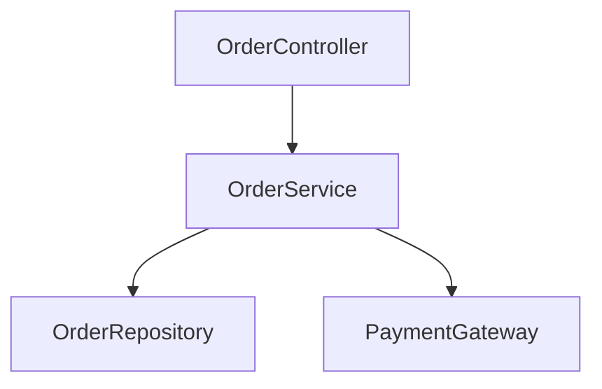
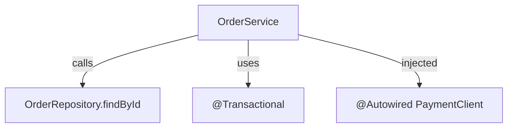

了解です！それでは第6章に進みます。

---

# 第6章　依存構造の解析とは何か

これまで「依存とは何か」「どんな種類があるのか」を理解してきました。
この章からは、**依存を実際に分析する方法** に入ります。

依存解析は、設計品質の評価、リファクタリング、影響調査、アーキテクチャ監査などに活用できます。
さらにこのガイドのゴールでもある **Spring Boot依存構造解析ツールの実現** につながります。

---

## 6.1 依存解析とは？

依存解析とは：

> **ソースコードの中から、クラス・メソッド・コンポーネント間の“依存関係”を抽出し構造化すること**

---

### ✅ 依存解析は設計を「見える化」する技術

例：

```java
public class OrderService {
    @Autowired
    private OrderRepository orderRepository;

    public Order findById(Long id) {
        return orderRepository.findById(id);
    }
}
```

このコードから依存解析が抽出すべき情報は：

| 解析対象   | 内容                                 |
| ------ | ---------------------------------- |
| クラス依存  | `OrderService` → `OrderRepository` |
| DI依存   | `@Autowired` あり                    |
| メソッド依存 | `findById()` 呼び出し                  |
| アーキ依存  | Service → Repository               |

---

### 🎯 依存を抽出するメリット

| メリット      | 例              |
| --------- | -------------- |
| 影響範囲を見える化 | サービス変更時にどこが影響？ |
| 循環依存の検出   | 設計崩壊を防ぐ        |
| CIで監視可能   | 依存ルール違反を自動検出   |
| ドキュメント代替  | アーキ図を自動生成      |

---

## 6.2 静的解析 vs 動的解析

依存解析には2つの手法があります。

| 種類      | 特徴                | 例              |
| ------- | ----------------- | -------------- |
| ✅ 静的解析  | コードを解析して依存を抽出     | AST分析、型解析      |
| ✅ 動的解析  | 実行時の依存を観測         | AOPログ、Profiler |
| ✅ 両方が必要 | SecurityやDI分析には特に |                |

---

### Spring Boot依存の場合どっち？

| 依存の種類                  | 解析方法       |
| ---------------------- | ---------- |
| クラス依存・メソッド依存           | 静的解析       |
| DI依存（@Autowired）       | 静的解析       |
| SecurityFilterChainの順序 | 動的 or 設定解析 |
| AOP依存（@Transactional）  | 静的＋動的      |
| AutoConfiguration依存    | 設定解析       |

✅ **結論：Spring Bootは静的解析だけでは不十分**

---

## 6.3 Java依存解析のテクニック

ソースコードから依存を抽出するには **AST解析（抽象構文木）** が一般的です。

例：`JavaParser` を使った解析イメージ

```java
CompilationUnit cu = JavaParser.parse(file);
cu.findAll(MethodCallExpr.class).forEach(m -> {
    System.out.println("呼び出し: " + m.getName());
});
```

---

## 6.4 Spring特有の依存解析

Spring Bootアプリには「コードに見えない依存」が存在します。

| 種類         | 例                     | 注意         |
| ---------- | --------------------- | ---------- |
| DI基盤       | `@Autowired`, `@Bean` | Bean解決関係   |
| AOP        | `@Transactional`      | プロキシ依存     |
| Security   | `SecurityFilterChain` | フィルタ順序     |
| Profile    | `@Profile("prod")`    | 環境によって依存変化 |
| AutoConfig | Starter内部でのBean依存     | 表に出にくい     |

✅ **Spring依存の解析＝アノテーション解析 + Bean登録解析**

---

## 6.5 依存構造の可視化

依存はグラフ構造で表すことができます。



あるいは詳細にすると：



---

## 6.6 依存解析モデル化（ツール設計の基盤）

次のようなモデルを設計します。

```
Dependency(
  source = "OrderService",
  target = "OrderRepository",
  type = METHOD_CALL,
  layer = SERVICE_TO_REPOSITORY
)
```

→ これが第7章から始まる**ツール実装想定**につながります 💡

---

### ✅ 第6章まとめ

| ポイント              | 内容                 |
| ----------------- | ------------------ |
| 依存解析は設計を見える化      | アーキ構造を明確にする        |
| Springは依存が多層的     | DI/AOP/Securityが影響 |
| 解析にはAST＋Bean解析が有効 | 静的 + アノテーション分析     |
| 可視化で理解が深まる        | Mermaid/Pumlで描く    |

---

📘 次はついに――
**第7章：依存関係のアンチパターンと問題分析** に入ります。

ここでは **循環依存 / Godクラス / Service膨張 / DI地獄** など、
実践で必ず出会う「依存の失敗例」と対処法を見ていきます ⚠️

