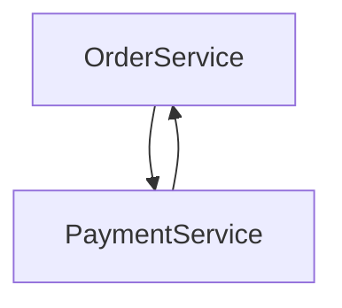
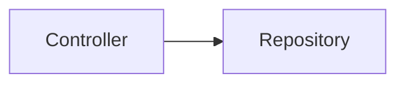

# 第7章　依存関係のアンチパターンと問題分析

依存はソフトウェアには欠かせない構造ですが、**設計を崩壊させる原因**にもなります。
Spring BootはDIによって依存管理を柔軟にしている一方、適切に管理しなければすぐに「破綻した依存構造」を持つシステムになってしまいます。

---

## 7.1 なぜ依存は設計を崩壊させるのか？

依存が管理されていないと次の問題が発生します。

| 問題        | 結果                             |
| --------- | ------------------------------ |
| 依存のスパゲティ化 | どのクラスが何に依存しているのか分からない          |
| 変更に弱い設計   | ひとつの変更が全体に波及                   |
| テスト不能     | モックが差し替えられない構造になる              |
| 循環依存      | コンパイルすらできない時限爆弾                |
| 層崩壊       | ControllerがRepositoryに依存する混乱構造 |

---

## 7.2 アンチパターン① 循環依存（Cycle Dependency）

最も危険な依存構造です。



```java
class OrderService {
    @Autowired PaymentService paymentService;
}
class PaymentService {
    @Autowired OrderService orderService;
}
```

🔴 問題：

* 無限依存ループ
* Bean生成が失敗する
* 設計の境界が崩壊

✅ 対策：

* 依存方向を見直す（依存の逆転：interface導入）
* 共通処理はFacadeに切り出す

---

## 7.3 アンチパターン② God Service（神サービス）

Spring Bootで最もよく出現する設計崩壊。

```java
@Service
class UserService {
    @Autowired OrderRepository orderRepo;
    @Autowired MailService mailService;
    @Autowired PaymentGateway payment;
    @Autowired PointCalculator pointCalc;
    @Autowired CampaignManager campaign;
    @Autowired S3Uploader uploader;

    // 500行以上の巨大クラス!!!!
}
```

🔴 問題：

* 依存の塊になり「変更できないクラス」に進化
* テスト不能・可読性喪失
* 「アプリ＝巨大Service1つ」状態へ暴走

✅ 対策：

* 責務を分割する（SRP原則）
* ApplicationService / DomainService で役割整理
* 「サービスの階層分離」を導入

---

## 7.4 アンチパターン③ レイヤー違反



```java
// Controllerから直接Repository呼び出し（NG）
@RestController
class UserController {
    @Autowired UserRepository userRepository;

    @GetMapping("/users")
    public List<User> list() {
        return userRepository.findAll();
    }
}
```

🔴 問題：

* Service層を飛ばしてビジネスロジックが散逸
* 共通処理が書けなくなる
* ロジック重複・保守不能

✅ 対策：
✔ ControllerはServiceに**のみ**依存する
✔ Repositoryに直接依存しない

---

## 7.5 アンチパターン④ DTO汚染・Entity漏洩

```java
// EntityをControllerで直接返す（危険）
@GetMapping("/users")
public List<UserEntity> getUsers() { ... }
```

🔴 問題：

* ドメイン内部構造が外部に漏れる
* JSON無限ループ（双方向参照）
* API仕様とDB構造が密結合

✅ 対策：

* DTO導入（APIと内部を分離）
* MapStructで変換集中管理

---

## 7.6 アンチパターン⑤ DI地獄（依存注入の乱用）

```java
@Service
class BadService {
    @Autowired A a;
    @Autowired B b;
    @Autowired C c;
    @Autowired D d;
    @Autowired E e;
    @Autowired F f;
}
```

🔴 問題：

* Serviceが依存倉庫になる
* 設計が破綻し始める前兆
* DIは補助機能であって設計ではない

✅ 対策：
✔ Facade / DomainService / Factoryに依存分散
✔ 不要な依存は削除

---

## 7.7 アンチパターン⑥ Security依存の崩壊

Spring Securityでよくあるやつ👇

❌ Controllerに `@AuthenticationPrincipal` 多用
❌ Serviceで `SecurityContextHolder` 直参照
❌ SecurityConfigが超巨大クラス化
❌ Filterが無秩序に追加される

✅ 解決策は次章の「改善パターン」で解説します。

---

## 7.8 依存診断チェックリスト（使える！）

| 質問                           | YESなら危険     |
| ---------------------------- | ----------- |
| ②つのクラスが相互参照している？             | 循環依存        |
| Serviceが巨大になっていない？           | God Service |
| Controller→Repositoryに依存してる？ | 層崩壊         |
| DTOなしでEntity返している？           | 内部漏洩        |
| Autowiredだらけ？                | DI地獄        |
| SecurityConfigが複雑化？          | 認証崩壊        |

---

✅ **第7章まとめ**
依存のアンチパターンは設計破綻のサイン。
依存図を描けば一発で診断できる！

---

次の章はいよいよラストの設計編👇
✅ **第8章：依存改善パターン（設計の型を身につける）** に進みます。

