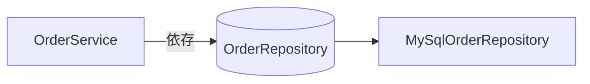
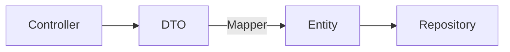
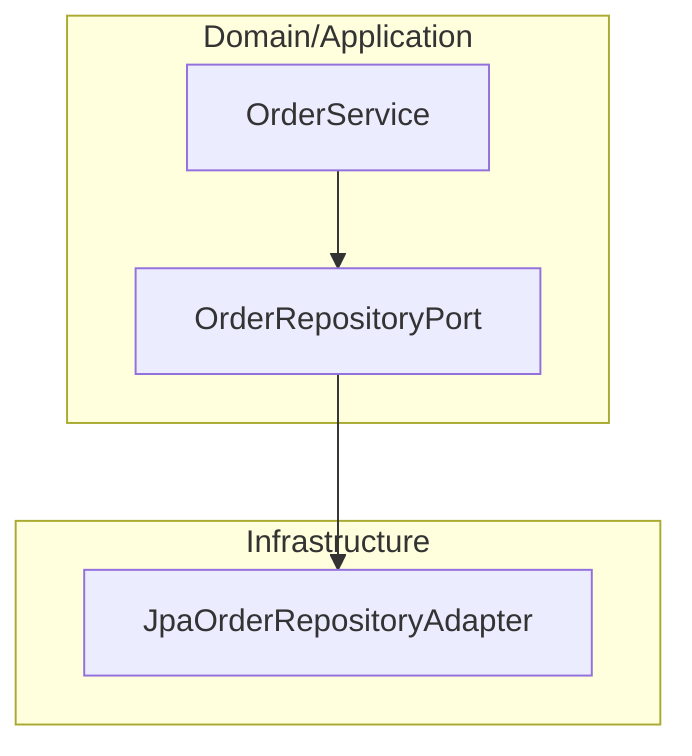

# 第8章　依存改善パターン（設計の型を身につける）

第7章では「悪い依存」を見てきました。この章ではそれを踏まえて、
**Spring Bootプロジェクトで使える依存設計のベストパターン**を身につけます。

---

## 8.1 良い依存とは何か（再確認）

良い依存の条件は次のとおりです：

| 条件       | 説明               |
| -------- | ---------------- |
| 一方向である   | 循環依存しない          |
| 役割に沿っている | 層構造が守られている       |
| 抽象に依存する  | 実装クラスではなくインタフェース |
| 局所化されている | 依存の影響範囲が明確       |
| テストしやすい  | モックを差し替えできる構造    |

✅ この条件を満たす依存を「クリーンな依存」と呼びます。

---

## 8.2 依存逆転の原則（DIP）の実践

**Bad例：実装に依存する構造**

```java
class OrderService {
    private MySqlOrderRepository repo = new MySqlOrderRepository(); // NG！
}
```

**Good例：抽象に依存**

```java
class OrderService {
    private final OrderRepository repo;
    public OrderService(OrderRepository repo) {
        this.repo = repo; // 抽象に依存！良い！
    }
}
```



✅ ポイント

* **DIP実装はインタフェース導入が鍵**
* Springでは `@Primary` や `@Qualifier` で実装切替が可能

---

## 8.3 Service肥大化を防ぐ分割パターン

**Bad例：God Service**

```java
@Service
class UserService {
    public void register() {}
    public void sendMail() {}
    public void calcPoint() {}
    public void uploadToS3() {}
}
```

**改善：役割ごとに分割**

```
UserService
 ├─ UserRegistrationService
 ├─ NotificationService
 ├─ PointCalculationService
 └─ StorageService
```

✅ 分割の型

| パターン           | 説明               |
| -------------- | ---------------- |
| UseCase分割      | ユースケース単位にService |
| Domain Service | 業務ルールのまとまり       |
| Facade         | 複雑な処理の窓口役        |

---

## 8.4 DTOとMapperによる依存制御

Entityが外部に漏れる問題を防ぐには、**DTOとMapper**を使います。



💡 MapStructを使った例：

```java
@Mapper(componentModel = "spring")
public interface UserMapper {
    UserDto toDto(User entity);
    User toEntity(UserDto dto);
}
```

✅ 依存の方向が綺麗に整理される！

---

## 8.5 Port & Adapter（依存逆転の型）

RepositoryやAPIを**内側から切り離す設計**。



✅ 依存の方向がドメイン側に統一され、保守性UP。

---

## 8.6 Security依存の整理パターン（実践）

Securityは下のように整理すると綺麗になる。

```
security/
 ├─ SecurityConfig.java            ← SecurityFilterChain定義
 ├─ JwtAuthenticationFilter.java   ← 認証フィルタ
 ├─ CustomUserDetailsService.java  ← ユーザ読込
 ├─ JwtTokenProvider.java          ← トークン生成/検証
 └─ CustomAuthenticationEntryPoint ← 未認証時の制御
```

✅ 悪い例の依存崩壊：

```
Controller ----> SecurityContextHolder（直接参照❌）
Service -------> HttpServletRequest（認証情報参照❌）
```

✅ 良い整理：

```
認証はSecurityレイヤで完結させる
ServiceやControllerにSecurity依存を漏らさない
```

---

## 8.7 依存設計の実践チェックリスト ✅

| No | 内容                          | できてる？ |
| -- | --------------------------- | ----- |
| 1  | ControllerはServiceにのみ依存している | ✅/❌   |
| 2  | 循環依存を防いでいる                  | ✅/❌   |
| 3  | Serviceは役割ごとに分割             | ✅/❌   |
| 4  | DTOとEntityを分離               | ✅/❌   |
| 5  | Security依存は専用レイヤに隔離         | ✅/❌   |
| 6  | 依存は抽象に向いている                 | ✅/❌   |

---

✅ **第8章まとめ**
依存の整理 = 設計の整理
設計はスキルではなく **型（パターン）で身につく**

---

次はいよいよラスト 🎯
📘 **Appendix：依存分類一覧（CSV）＋用語集＋演習問題** に入ります。

